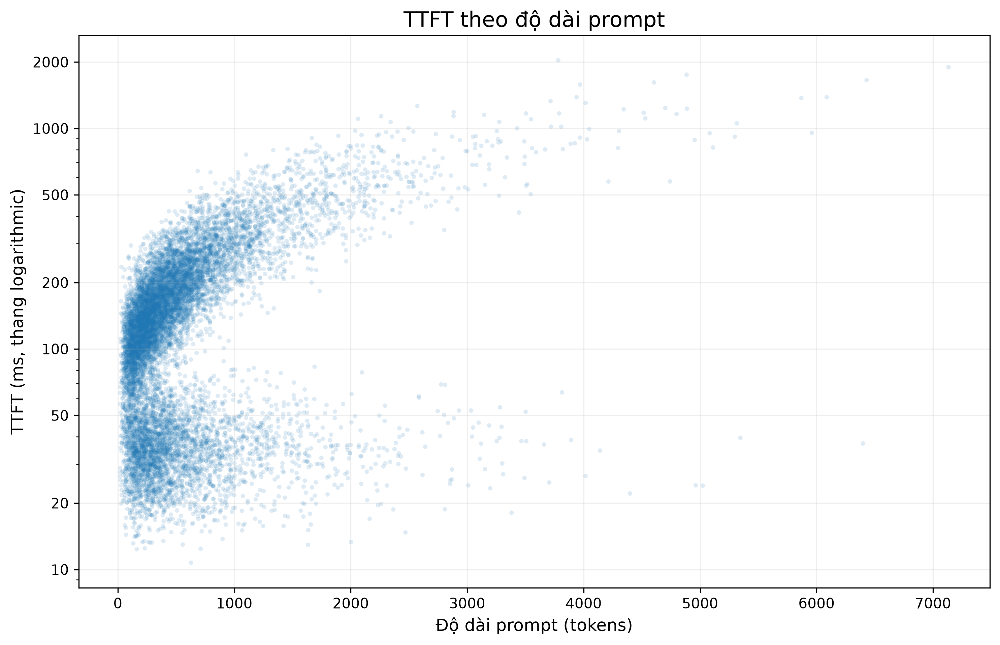

# Phân tích độ trễ hệ thống phục vụ mô hình ngôn ngữ

## 1. Tình trạng dữ liệu

**[đo được]** `requests.csv` ban đầu có 12.040 dòng nhưng chỉ có 12.000 `request_id` khác nhau. Có 40 `request_id` xuất hiện đúng hai lần và các cặp tương ứng trùng hoàn toàn trên cả 7 cột; vì vậy em giữ một bản ghi đại diện cho mỗi cặp và loại 40 bản sao dư, còn 12.000 request duy nhất [ô 07–09].

**[đo được]** Trong 12.000 request sau xử lý duplicate có 11.689 request `ok`, 136 request `cancelled` và 175 request `error` [ô 10]. Toàn bộ request `error` có `output_tokens = 0`, trong khi toàn bộ `ok` và `cancelled` đều có `output_tokens > 0` [ô 12, ô 17]. Các request `cancelled` còn có `ttft_ms > 0` và `ttft_ms <= e2e_ms` [ô 15].

**[suy ra]** Để phân tích TTFT, em cần bằng chứng rằng request đã thực sự sinh token đầu tiên. Vì vậy em loại 175 request `error` khỏi tập TTFT vì chúng không có token đầu ra, nhưng giữ 136 request `cancelled` vì chúng đã sinh token và các quan hệ thời gian cơ bản vẫn hợp lý [ô 12, ô 15, ô 18].

**[đo được]** Tập cuối dùng cho phân tích TTFT gồm 11.825 request, trong đó có 11.689 `ok` và 136 `cancelled` [ô 18]. Sau bước này không còn `request_id` lặp, không có `output_tokens <= 0`, `ttft_ms <= 0`, `ttft_ms > e2e_ms`, `prompt_tokens <= 0` hoặc `arrival_ts_ms < 0` trong tập TTFT [ô 19].

**[phỏng đoán]** Nguyên nhân kỹ thuật tạo ra các bản ghi lặp và nguyên nhân khiến 175 request kết thúc ở trạng thái `error` không thể xác định từ các cột hiện có [ô 08, ô 10].

## 2. Phân phối TTFT

**[đo được]** Trên 11.825 request hợp lệ, TTFT có median 130,90 ms, Q95 433,15 ms và giá trị lớn nhất 2.036,46 ms; Q95 lớn gấp khoảng 3,31 lần median, còn max lớn gấp khoảng 15,56 lần median [ô 20]. Histogram với nhiều cách chia bin cho thấy hình dạng chính không biến mất khi thay đổi số bin [ô 21–22].

**[suy ra]** Các thống kê và hình dạng thực nghiệm cho thấy TTFT lệch phải và có long tail: phần lớn quan sát nằm ở mức thấp hơn nhiều so với các giá trị cực đại, trong khi phía latency lớn kéo dài rõ rệt [ô 20–22].

**[đo được]** Phân phối còn có cấu trúc bên trong. Vùng `<60 ms` có 3.401 request, chiếm 28,76%, với median 34,57 ms và IQR 15,28 ms; vùng `60–80 ms` chỉ có 486 request, chiếm 4,11%, với median 69,30 ms; nhánh `>=80 ms` có 7.938 request, chiếm 67,13%, với median 177,33 ms và IQR 127,65 ms [ô 36].

**[suy ra]** Vùng mật độ thấp ở `60–80 ms` nằm giữa một nhóm latency thấp và một nhánh phía trên lớn hơn, nên em mô tả phân phối là có cấu trúc bimodal thay vì coi toàn bộ TTFT là một phân phối một đỉnh duy nhất [ô 23, ô 30, ô 36]. Phép biến đổi log làm hai vùng tập trung dễ quan sát hơn nhưng không biến dữ liệu thành một phân phối một đỉnh gần Normal [ô 30].

**[đo được]** Quan hệ với độ dài prompt khác rõ giữa hai vùng. Với TTFT `<60 ms`, Pearson correlation giữa `prompt_tokens` và TTFT là khoảng -0,0243; với TTFT `>=80 ms`, correlation là khoảng 0,8576; nếu gộp toàn bộ request thì correlation khoảng 0,6097 [ô 32]. Hồi quy tuyến tính trên nhánh `>=80 ms` có slope khoảng 0,223847 ms/token, tương đương khoảng 22,38 ms trên mỗi 100 prompt token, với intercept khoảng 89,50 ms [ô 33].

**[suy ra]** Vùng latency thấp gần như không có quan hệ tuyến tính với độ dài prompt, trong khi nhánh phía trên tăng rõ khi prompt dài hơn [ô 32–33]. Vì hai pattern vẫn xuất hiện trong cùng các khoảng prompt length, độ dài prompt một mình không đủ để quyết định một request nằm ở vùng nào [ô 73].

**[phỏng đoán]** Một cơ chế có thể tạo ra hai pattern là tồn tại hai chế độ xử lý, chẳng hạn một số request được hưởng prefix/cache reuse trong khi số khác phải thực hiện nhiều prefill computation hơn. Tuy nhiên dataset không có biến về cache, prefill, batching, scheduler hay worker, nên em không xem đây là kết luận kỹ thuật đã được chứng minh [ô 73, ô 79].

## 3. Các con số tóm tắt

**[đo được]** Các point estimate và khoảng tin cậy của TTFT được tóm tắt như sau [ô 41–44]:

| Metric | Ước lượng | Khoảng tin cậy 95% [ô 41–44] | Cách ước lượng |
|---|---:|---:|---|
| Mean | 161,449 ms | [158,756; 164,142] ms | Normal approximation [ô 41] |
| p50 | 130,900 ms | [128,800; 133,040] ms | Percentile bootstrap, B = 5.000 [ô 42] |
| p90 | 324,866 ms | [318,280; 332,580] ms | Percentile bootstrap, B = 5.000 [ô 42] |
| p99 | 737,139 ms | [692,340; 779,844] ms | Percentile bootstrap, B = 5.000 [ô 42] |

**[đo được]** Relative width của bootstrap confidence interval là 3,239% đối với p50, 4,402% đối với p90 và 11,871% đối với p99 [ô 43].

**[suy ra]** Mean là con số dễ gây hiểu nhầm nhất nếu được gọi là TTFT “điển hình”. Mean gộp chung hai vùng latency có hành vi khác nhau và còn nhạy với long tail; vì vậy một giá trị trung bình duy nhất che khuất cấu trúc quan trọng đã thấy ở Câu 2 [ô 20, ô 36, ô 44].

**[suy ra]** P50 ít nhạy với các giá trị cực trị hơn mean nhưng nếu đứng một mình vẫn không thể hiện bimodality. P90 và p99 bổ sung thông tin về tail latency; trong đó p99 có sampling uncertainty tương đối lớn hơn, thể hiện qua relative CI width 11,871% [ô 43].

**[suy ra]** Các confidence interval ở đây mô tả sampling uncertainty theo phương pháp đã chọn, không phải khoảng chứa phần lớn request. Đặc biệt, percentile bootstrap cho các quantile dựa trên giả định rằng resampling từng request là một xấp xỉ phù hợp cho quá trình lấy mẫu mà em muốn mô phỏng [ô 42].

## 4. Cần bao nhiêu request để ước lượng p99?

**[đo được]** Em dùng 11.825 request TTFT hợp lệ làm empirical population và lấy p99 của toàn bộ tập, 737,139 ms, làm empirical reference [ô 45]. Sai số mục tiêu ±10% tương ứng với việc sample p99 nằm trong khoảng 663,425–810,853 ms [ô 45].

**[suy ra]** Em thiết kế một trial bằng cách lấy ngẫu nhiên `n` request, tính sample p99 rồi đánh dấu thành công nếu relative error so với empirical reference không vượt ±10% [ô 45–47]. Em dùng mức thành công khoảng 95% qua nhiều simulated measurement runs làm tiêu chí thiết kế để xem một sample size là đủ ổn định; đây là lựa chọn phương pháp của em, không phải ngưỡng được đề bài cho sẵn [ô 54].

**[đo được]** Một trial đơn lẻ có thể gây hiểu nhầm: với `n = 500`, một trial cho relative error 4,05% và được đánh dấu thành công, nhưng khi lặp 1.000 trial thì success rate chỉ còn 60,90% [ô 46–47].

**[đo được]** Khi sampling có hoàn lại để mô phỏng các measurement run mới từ empirical distribution, `n = 2.500` đạt success rate 92,76%, còn `n = 3.000` đạt 95,18% trong 5.000 trial [ô 53]. Kiểm tra cuối quanh vùng ngưỡng cho mean success rate lần lượt 94,30%, 94,98%, 95,24%, 95,60% và 95,99% tại `n = 2.800`, `2.900`, `3.000`, `3.100` và `3.200` [ô 54].

**[suy ra]** Với empirical distribution hiện tại và tiêu chí khoảng 95% simulated measurements có p99 nằm trong ±10% reference, em kết luận cần **khoảng 3.000 request** [ô 54]. Đây là một kết quả empirical gần đúng, không phải một ngưỡng chính xác áp dụng chung cho mọi hệ thống.

**[đo được]** Nếu lấy mẫu không hoàn lại trực tiếp từ chính cửa sổ 11.825 request, vùng ngưỡng thấp hơn, khoảng 2.400–2.500 request, do sample chiếm tỷ lệ đáng kể của population hữu hạn [ô 50–52].

**[suy ra]** Em ưu tiên kết quả khoảng 3.000 request làm câu trả lời chính vì sampling có hoàn lại phù hợp hơn với cách diễn giải “một measurement run mới” được lấy từ empirical distribution, trong khi kết quả không hoàn lại được giữ như một sensitivity check [ô 53–54].

## 5. Một hình quan trọng nhất

**[suy ra]** Em chọn scatter plot TTFT theo độ dài prompt vì nó cho thấy đồng thời hai pattern quan trọng: một vùng TTFT thấp gần như không thay đổi theo prompt length và một nhánh TTFT cao tăng rõ khi prompt dài hơn [ô 59–60].

**[suy ra]** Histogram log(TTFT) làm bimodality rõ hơn nhưng loại bỏ thông tin về prompt length, còn hexbin xử lý overplotting tốt hơn nhưng làm các request hiếm trong long tail kém nổi bật [ô 56–57].

**[suy ra]** Em dùng trục TTFT logarithmic để giữ toàn bộ long tail mà vẫn nhìn rõ vùng latency thấp, chấp nhận rằng khoảng cách trên trục Y không còn biểu diễn chênh lệch millisecond theo thang tuyến tính [ô 60].

## 6. Những điều chưa xác định được

### Cơ chế nào tạo ra hai pattern TTFT?

**[đo được]** Trong cùng các khoảng `prompt_tokens` vẫn đồng thời tồn tại vùng TTFT `<60 ms` và nhánh `>=80 ms`; ngay cả khi giữ chính xác cùng `prompt_tokens` trong nhánh trên, TTFT vẫn còn biến thiên đáng kể [ô 73, ô 79]. TTFT cũng gần như không có quan hệ tuyến tính với median ITL hoặc p90 ITL sau first token, với correlation lần lượt khoảng 0,0003 và 0,0016 [ô 66].

**[suy ra]** Prompt length một mình không giải thích được hai pattern, và sự khác biệt quan sát được có vẻ tập trung nhiều hơn ở giai đoạn trước first token chứ không đi kèm một slowdown tuyến tính tương ứng trong generation [ô 66, ô 73].

**[phỏng đoán]** Dataset hiện tại chưa thể phân biệt cache/prefix reuse, full prefill, processing path, batching, queueing hay worker effect. Để kiểm tra cần thêm các biến như `cache_hit`, `cached_prompt_tokens`, `prefix_reuse_tokens`, `prefill_time_ms`, `batch_id`, `worker_id` hoặc processing-path identifier [ô 73, ô 79].

### Queueing, batching và scheduling đóng góp bao nhiêu vào latency?

**[đo được]** Ở mức aggregate, tỷ lệ request có E2E residual lớn trong giai đoạn traffic cao hơn phần còn lại, nhưng sau khi chia theo độ dài output thì khác biệt không còn nhất quán giữa các nhóm [ô 72, ô 84].

**[suy ra]** `arrival_ts_ms` cho biết request đến khi nào nhưng không cho biết request chờ queue bao lâu, được ghép vào batch nào hoặc concurrency thực tế tại thời điểm xử lý [ô 72, ô 84].

**[phỏng đoán]** Muốn tách ảnh hưởng của queueing, batching và scheduling cần thêm `processing_start_ts_ms` hoặc `queue_time_ms`, cùng `batch_id`, `batch_size`, `active_requests`, `scheduler_state` và `worker_id` [ô 72, ô 84].

### Phần E2E không được TTFT và ITL giải thích là gì?

**[đo được]** Em tính `E2E residual = e2e_ms - ttft_ms - sum(itl_ms)`. Median residual là khoảng 3,241 ms, p95 khoảng 8,146 ms; có 108 request có residual lớn hơn 1.000 ms và giá trị lớn nhất khoảng 10.919,831 ms [ô 68, ô 86]. Phần tail này chủ yếu nằm ở request `ok`, nên giả thuyết ban đầu rằng nó được giải thích bởi `cancelled` không phù hợp với dữ liệu [ô 69].

**[suy ra]** Residual lớn xuất hiện ở một nhóm nhỏ request chứ không giống một overhead tăng đều theo mọi token [ô 68, ô 83].

**[phỏng đoán]** Dữ liệu hiện tại chưa xác định residual thuộc network delivery, finalization, runtime pause, logging behavior hay measurement boundary khác. Để phân biệt cần thêm `first_token_ts_ms`, `last_token_ts_ms`, `completion_ts_ms`, `token_timestamp_ms` và `measurement_source` [ô 68, ô 85].

### Các pattern có generalize ngoài cửa sổ đo hiện tại không?

**[đo được]** Trong cửa sổ hiện tại, nửa đầu và nửa sau có p50/p90 TTFT và tỷ lệ hai vùng khá gần nhau; tỷ lệ `<60 ms` lần lượt khoảng 28,64% và 28,91%, còn tỷ lệ `>=80 ms` khoảng 67,10% và 67,16% [ô 80].

**[suy ra]** Các pattern chính tương đối ổn định bên trong cửa sổ đo hiện tại, nhưng dữ liệu chỉ từ một measurement window nên không đủ để kết luận chúng sẽ giữ nguyên ở giờ khác, ngày khác hoặc workload khác [ô 80].

**[phỏng đoán]** Để kiểm tra khả năng generalize cần nhiều measurement windows và metadata như `measurement_window_id`, `model_version`, `config_id`, deployment/hardware metadata và thông tin workload/system load [ô 80].

### Vì sao một số request bị cancelled?

**[đo được]** Có 136 request `cancelled`; median `output_tokens` của nhóm này là 25 token, thấp hơn nhóm `ok` với median 118 token [ô 81]. Cancellation cũng không tập trung rõ vào riêng một TTFT branch hoặc chỉ trong giai đoạn traffic cao [ô 82].

**[suy ra]** Các request `cancelled` thường kết thúc generation sau ít token hơn, nhưng các biến hiện tại không cho biết nguyên nhân của việc kết thúc [ô 81–82].

**[phỏng đoán]** Để phân biệt client cancellation, timeout/deadline, network disconnect, server-side cancellation hoặc cơ chế khác cần thêm `cancel_reason`, `cancel_source`, `cancel_request_ts_ms`, `cancel_ack_ts_ms`, `stop_reason`, `requested_max_tokens` và `timeout_ms`/`deadline_ms` [ô 81–82].

## Kết luận ngắn

**[suy ra]** Điều quan trọng nhất em học được từ dataset này là không nên bắt đầu bằng một con số tóm tắt rồi cố giải thích mọi thứ từ nó. Audit dữ liệu làm thay đổi tập request được phép phân tích; quan sát phân phối cho thấy TTFT có cấu trúc bên trong; các quantile cao cần được báo cáo cùng uncertainty; và khi dữ liệu không đủ để phân biệt nhiều cơ chế kỹ thuật cùng phù hợp với một observation, câu trả lời đúng là chỉ rõ giới hạn bằng chứng và dữ liệu cần thu thêm [ô 18–20, ô 36, ô 43, ô 86].
